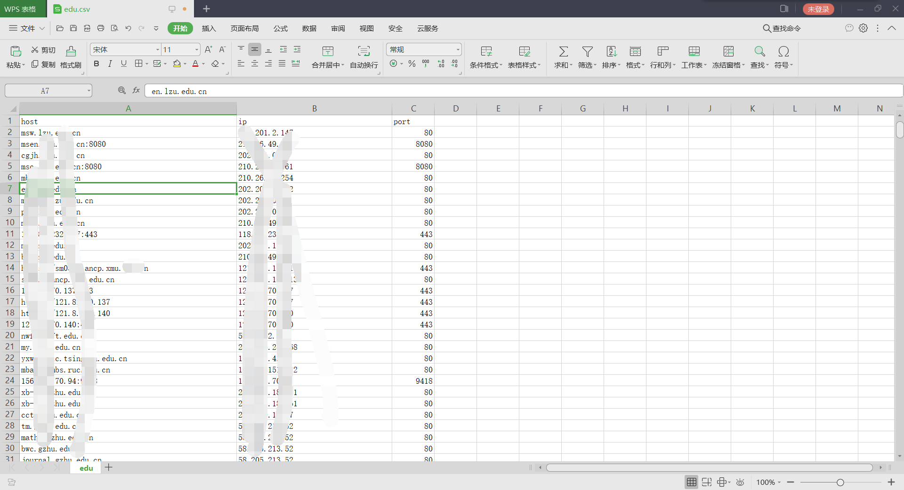

# LuckyScan 
### 新功能正在开发中...

>   自己手敲的一款基于Fofa api查询的信息搜集工具,  我个人感觉好用的,  暂时先不开源, 等毕业后在开源, 功能会陆续添加.
>   **切勿用于非法用途, 后果自行承担, 仅限学习交流!!!!!!!**

## 依赖项

### 基于python编写的图形化信息搜集工具, 我这边已经打包好了,所以直接使用就好了, 但是需要fofa会员, 普通会员默认就是100条数据, 高级会员默认100条数据可改.

## 项目结构

```
UI: UI目录
LuckyScan.exe: 主程序
config.yaml: 配置文件
```

## 工具界面

#### 界面


#### 配置文件

`输入完会自动读取到工具中, 也可以在工具中主动添加`


#### 使用效果




## 网络乞丐

### `觉得好用的可以赞助一下喔, 功能会陆续添加!!!  有朋自远方来, 给我捐点把! 肚子饿了!!!!!!!`


## 版本更新信息

### 2021.8.12 更新
#### 			优化了Fofa查询功能的里面的字段信息, 如果访问没有获取数据多试几次, 访问频率过快会导致数据提取失败, 记得关注keyApi是否过期, 过期了也获取不到数据的喔^v^.

#### 			设计了DirScan的UI(半成品), 太忙了, 功能还未添加...

